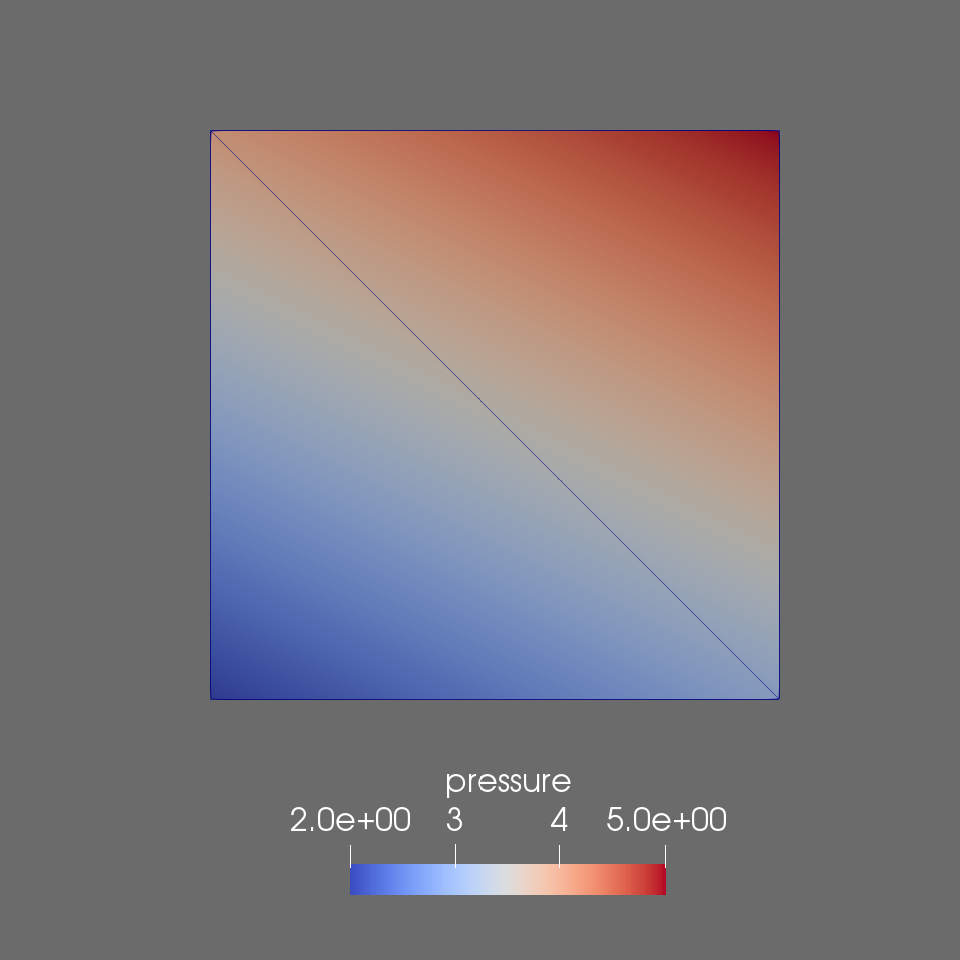

# Triangles-Fortan
Various subroutines to deal with triangles

## Write vtu data for Paraview

This subroutines write unstructured data (in this case triangular mesh) to a `.vtu` file that can be red into paraview. `write_vtu.f90` writes to the `ascii` format that is human-readable, whereas `write_vtu_raw` writes to binary format. The way data is written into `.vtu` is very different and debugging binary files is hard.

To build the `ascii` writer you can simply compile it with
```bash
gfortran write_vtu.f90 -o write_vtu
```
and then run it with
```bash
./write_vtu
```
this will create the file [triangles](triangles.vtu), which look like this (the pressure and velocity field are arbitrary).



if you want to compile the binary writer you can simply replace the source file with the corresponding one. If you want to compile with double precision instead of single you will need the following flags (plus uncomment line 27 in `write_vtu_raw.f90`)
```bash
gfortran write_vtu_raw.f90 -o write_vtu -DDUBON -fdefault-real-8
```

## Distance to triangle

Algorithm to find the closest distance to a triangle.

Build
```bash
gfortran tri_distance.f90 -o distance
```
Run
```bash
./distance
```
